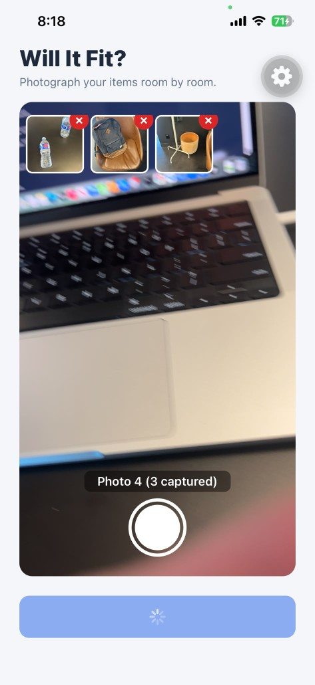
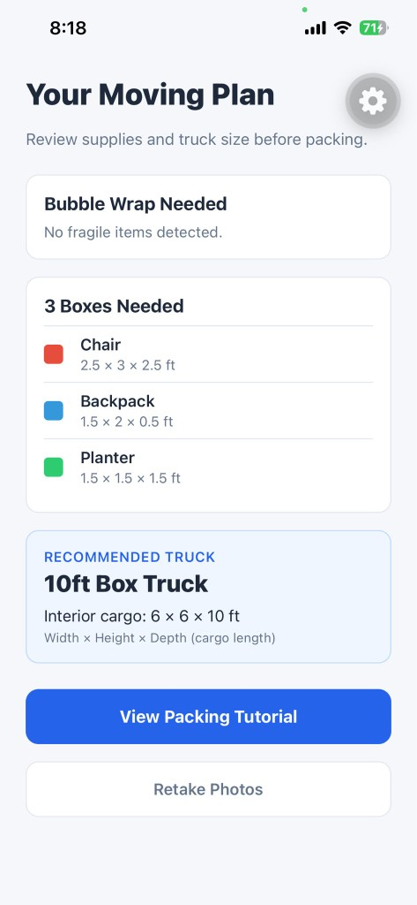
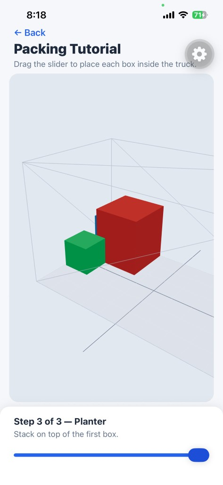

# Will It Fit?

A mobile app that helps you plan a move. Photograph your belongings room by room, get an AI-generated packing plan with supply recommendations and truck size, then follow an interactive 3D tutorial that shows you how to load everything into the truck.

## What It Does

Will It Fit? turns a pile of moving-day guesswork into a clear, step-by-step plan:

- **Inventory from photos** — snap pictures of furniture, boxes, and other items you need to move
- **AI-powered analysis** — identifies each item, estimates dimensions, and flags fragile pieces
- **Supply & truck recommendations** — tells you how many boxes you need, whether bubble wrap is required, and which rental truck size fits
- **3D packing guide** — walks you through loading each box into the truck with an interactive slider and real-time 3D visualization

All dimensions are in **feet**.

## How It Works

### 1. Photograph your items

Open the camera screen and take photos of everything you plan to move. Thumbnails appear at the top so you can review or remove shots before continuing. When you're ready, tap **Analyze Photos** to send the images for processing.



### 2. Review your moving plan

The app returns a summary dashboard with everything you need before packing day:

- **Bubble wrap** — lists fragile items that need extra protection (or notes when none were detected)
- **Boxes** — each identified item with color-coded dimensions (width × height × depth)
- **Recommended truck** — suggested vehicle size with interior cargo dimensions

From here you can retake photos or proceed to the packing tutorial.



### 3. Follow the 3D packing tutorial

The packing screen renders a wireframe truck and colored boxes matching your plan. Drag the slider to step through each item one at a time — the 3D view shows exactly where each box goes and how to stack items efficiently.



## Tech Stack

| Layer | Technology |
|---|---|
| Framework | [Expo SDK 56](https://docs.expo.dev/) / React Native 0.85 |
| Language | TypeScript |
| Navigation | [Expo Router](https://docs.expo.dev/router/introduction/) (file-based) |
| Camera | [expo-camera](https://docs.expo.dev/versions/latest/sdk/camera/) |
| AI analysis | [OpenAI Vision API](https://platform.openai.com/docs/guides/vision) (`gpt-4o`) |
| 3D rendering | [Three.js](https://threejs.org/) + [@react-three/fiber](https://docs.pmnd.rs/react-three-fiber) (native) |
| OpenGL | [expo-gl](https://docs.expo.dev/versions/latest/sdk/gl-view/) |
| 3D controls | [r3f-native-orbitcontrols](https://github.com/nickshanks/r3f-native-orbitcontrols) |
| Image processing | [expo-image-manipulator](https://docs.expo.dev/versions/latest/sdk/imagemanipulator/) |
| Dev client | [expo-dev-client](https://docs.expo.dev/versions/latest/sdk/dev-client/) |

## Installation

### Prerequisites

- [Node.js](https://nodejs.org/) 18+ and npm
- A physical iOS or Android device (recommended — the 3D view often renders blank in the iOS Simulator)
- For local builds: [Xcode](https://developer.apple.com/xcode/) (macOS, iOS) and/or [Android Studio](https://developer.android.com/studio) (Android)

### 1. Clone the repository

```bash
git clone https://github.com/gcjunior/WillItFit.git
cd WillItFit
```

### 2. Install dependencies

```bash
npm install
```

### 3. Configure environment variables

```bash
cp .env.example .env
```

Edit `.env` and add your OpenAI API key:

```
EXPO_PUBLIC_OPENAI_API_KEY=sk-your-key-here
```

To try the app without an API key, set mock mode:

```
EXPO_PUBLIC_USE_MOCK=true
```

When mock mode is enabled, a **Run Demo (Mock Data)** button appears on the home screen so you can test the full flow with sample data.

### 4. Start the development server

```bash
npm start
```

This launches the Expo dev client. Scan the QR code with your device, or run a native build:

```bash
npm run ios      # iOS (requires Xcode)
npm run android  # Android (requires Android Studio / emulator)
```

## Project Structure

```
app/              Screens — camera, summary, packing (Expo Router)
components/       Camera, summary dashboard, and 3D packing UI
context/          Analysis state provider (photos, results, loading)
services/         OpenAI Vision integration and mock analysis
types/            Shared TypeScript types for analysis results
constants/        App config, theme, and box colors
utils/            Analysis helpers
```

## Important Notes

- **Test 3D on a physical device.** The iOS Simulator frequently shows a blank OpenGL canvas.
- **API keys in `EXPO_PUBLIC_*` are bundled into the app.** For production, route requests through a backend proxy instead of exposing keys client-side.
- **Camera permission** is required on first launch to photograph items.

## License

Private — see repository owner for usage terms.
