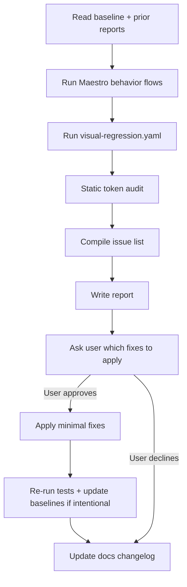

# UI Consistency Review Agent

An autonomous agent that reviews **Will It Fit?** like a careful human tester: it runs the app through real user flows, compares screenshots against saved baselines, audits styles against the design doc, **reports all issues**, and **asks before applying any fix**.

## Product decisions (confirmed)

| Topic | Decision |
|-------|----------|
| Fix policy | **Report only** — list issues and ask the user which to fix |
| Typography | Screen title 28px, subtitle 14px, secondary button 14px |
| Testing | **Behavior flows + screenshot comparison** |
| Screenshot storage | Reference PNGs in `public/screenshots/{screen}.png`; compare only (no auto-capture) |

## Goals

1. **Detect** visual and interaction inconsistencies (typography, spacing, buttons, layout, pixels).
2. **Verify** with Maestro behavior tests and `assertScreenshot` against saved baselines.
3. **Document** rules in `docs/ui-design-system-baseline.md` and append learnings after each run.
4. **Report** findings in `docs/reports/ui-consistency-YYYY-MM-DD.md`.
5. **Ask** the user which reported issues should be fixed — never auto-fix without approval.

## Non-goals

- Rewriting the design system without human approval.
- Camera/OpenAI integration testing (use mock mode).
- Pixel-perfect 3D canvas comparison (lower threshold on packing screen).

---

## Architecture



### Tooling

| Layer | Tool | Why |
|-------|------|-----|
| Behavior tests | [Maestro](https://docs.maestro.dev/) flows in `.maestro/flows/` | Drives the real app like a user |
| Screenshot references | `public/screenshots/*.png` | One file per screen name; committed manually |
| Mock data | `EXPO_PUBLIC_USE_MOCK=true` | Deterministic flow without camera/API |
| Design rules | `docs/ui-design-system-baseline.md` | Canonical typography and tokens |
| Static checks | ripgrep on styles | Catches token drift code can't see in pixels |

### Platform note

**CI uses iOS Simulator** on GitHub Actions (`macos-15` runner). See `.github/workflows/ios-maestro.yml`.

Locally, use the **same iPhone simulator model + iOS version** every time for screenshot baselines.

> **Known risk:** Expo SDK 56 / RN 0.85.3 may expose an empty accessibility tree to Maestro on some iOS versions ([maestro#3367](https://github.com/mobile-dev-inc/maestro/issues/3367)). If CI behavior tests fail while the UI is visibly correct, check the uploaded artifacts and track that upstream issue.

---

## Agent workflow

### Phase 0 — Bootstrap

1. Read `AGENTS.md`, `constants/theme.ts`, `docs/ui-design-system-baseline.md`.
2. Read the latest `docs/reports/ui-consistency-*.md`.
3. Confirm `EXPO_PUBLIC_USE_MOCK=true` for automated runs.
4. Verify references exist: `npm run test:ui:check-screenshots`

### Phase 1 — Behavior tests

```bash
export EXPO_PUBLIC_USE_MOCK=true
npm run android

# Terminal 2
npm run test:ui:behavior
# maestro test .maestro/flows/mock-demo-to-summary.yaml ...
# maestro test .maestro/flows/summary-to-packing.yaml ...
# maestro test .maestro/flows/packing-navigation.yaml ...
# maestro test .maestro/flows/retake-photos.yaml
```

Assert visible labels, navigation, and step text — what a user would notice.

### Phase 2 — Screenshot comparison

Compares each screen to reference PNGs in `public/screenshots/` (filenames match screen names).

```bash
npm run test:ui:visual
```

| Reference file | Screen | Match threshold |
|----------------|--------|-----------------|
| `public/screenshots/index.png` | Camera home (`/`) | 98% |
| `public/screenshots/summary.png` | Moving plan | 98% |
| `public/screenshots/packing.png` | Packing tutorial | 90% (3D varies) |

On failure: inspect Maestro diff PNGs (e.g. `public/screenshots/summary_diff.png`).

**Adding references:** save screenshots manually into `public/screenshots/` — see `public/screenshots/README.md`. Re-commit when the design intentionally changes.

### Phase 3 — Static audit

```bash
rg "fontSize:|fontWeight:|edges=\[" app/ components/
rg "#[0-9A-Fa-f]{6}" app/ components/ --glob '!**/Truck*.tsx'
```

Map hits to baseline rules and the seed inconsistency table.

### Phase 4 — Report (no fixes yet)

Write `docs/reports/ui-consistency-YYYY-MM-DD.md`. Include:

- Behavior test results
- Screenshot comparison results (pass/fail + diff paths)
- Static audit issues with severity
- **Recommended fixes** grouped by effort

End the report with:

> **Which issues should I fix?** Reply with issue IDs (e.g. UI-001, UI-002) or "fix all safe".

### Phase 5 — Fix (only after user approval)

| Category | Fix when user says yes |
|----------|------------------------|
| Token drift (wrong fontSize) | Align to baseline |
| Hardcoded hex matching a theme token | Replace with token |
| New theme token | Add to `theme.ts` + baseline doc |
| Layout / safe area | Only if user explicitly approves |
| Intentional visual redesign | Re-capture screenshot baselines |

After fixes: re-run behavior + visual tests, then ask whether to update baselines.

### Phase 6 — Learn & document

Update baseline **Changelog** with new rules, exceptions, and baseline refresh dates.

---

## Report template

```markdown
# UI Consistency Report — YYYY-MM-DD

## Summary
- Behavior flows: N passed / M failed
- Screenshot checks: N passed / M failed
- Static issues: X
- Fixes applied: 0 (awaiting approval)

## Behavior test results
| Flow | Result | Notes |
|------|--------|-------|

## Screenshot comparison
| Screen | Baseline | Result | Threshold | Diff |
|--------|----------|--------|-----------|------|
| Camera home | index.png | pass/fail | 98% | path or — |

## Issues

### UI-NNN — Title
- **Severity:** high | medium | low
- **Source:** behavior | screenshot | static
- **Screen:**
- **Observed:**
- **Expected (baseline):**
- **Status:** open
- **Suggested fix:**

## Recommended fixes (awaiting your approval)
1. UI-001 — …
2. UI-002 — …

> **Which issues should I fix?**
```

---

## npm scripts

| Script | Command |
|--------|---------|
| `npm run test:ui:behavior` | All behavior Maestro flows |
| `npm run test:ui:visual` | Screenshot comparison vs `public/screenshots/` |
| `npm run test:ui` | Behavior + visual |
| `npm run test:ui:ci` | CI entrypoint (behavior + visual if references exist) |
| `npm run test:ui:check-screenshots` | Verify reference PNGs exist |

## GitHub Actions (iOS)

Workflow: `.github/workflows/ios-maestro.yml` — runs on `pull_request` and push to `master` / `main`.

```
checkout → npm ci → mock mode → Maestro install
    → expo prebuild (ios) → boot Simulator → Release build
    → grant camera → Maestro behavior (+ visual if public/screenshots/*.png exist)
    → upload .maestro/results + diff images
```

**Visual regression:** requires `public/screenshots/index.png`, `summary.png`, `packing.png` committed manually. Until then, CI runs behavior tests only.

**Artifacts:** each run uploads `maestro-ios-<run_id>` with JUnit XML, debug output, screenshots, and diff PNGs.

---

## Cursor agent

Invoke via `.cursor/agents/ui-consistency-reviewer.md`:

- "Run UI consistency review"
- "Run Maestro flows and screenshot comparison; report issues"

---

## Resolved product questions

- **Fix scope:** Report and ask before fixing ✓
- **Typography canon:** 28 / 14 / 14 ✓
- **Visual regression:** Behavior + screenshot baselines ✓

## Still open (log in report if relevant)

- Truck highlight card — special accent vs new theme token?
- CI on every PR via EAS Workflows?
- iOS Maestro when accessibility tree is fixed?
