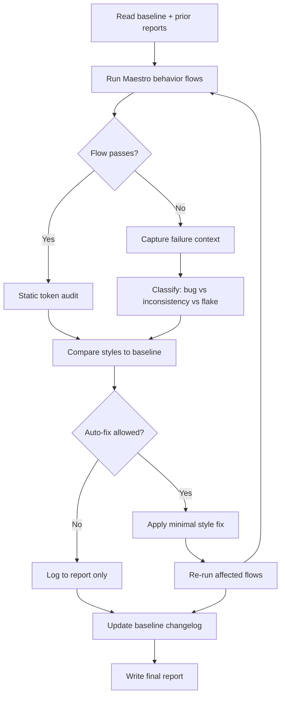

# UI Consistency Review Agent

An autonomous agent that reviews **Will It Fit?** like a careful human tester: it runs the app through real user flows, compares what it sees against the design baseline, fixes safe inconsistencies, documents what it learns, and emits a structured report.

## Goals

1. **Detect** visual and interaction inconsistencies across screens (typography, spacing, buttons, safe areas).
2. **Verify** fixes by re-running behavior tests — not just reading code.
3. **Document** canonical rules in `docs/ui-design-system-baseline.md` and append learnings after each run.
4. **Report** all findings in `docs/reports/ui-consistency-YYYY-MM-DD.md` (open issues + fixes applied).

## Non-goals

- Pixel-perfect visual regression on 3D OpenGL canvas (device-dependent; test presence and step labels instead).
- Rewriting the design system without human approval.
- Camera/OpenAI integration testing (use mock mode).

---

## Architecture



### Tooling

| Layer | Tool | Why |
|-------|------|-----|
| Behavior tests | [Maestro](https://docs.maestro.dev/) | Drives the real app via accessibility tree; no test library in the bundle |
| Mock data | `EXPO_PUBLIC_USE_MOCK=true` | Deterministic full flow without camera/API |
| Design rules | `docs/ui-design-system-baseline.md` | Single source of truth the agent reads and updates |
| Static checks | ripgrep on `fontSize`, hardcoded hex, `SafeAreaView` edges | Fast second pass after behavior tests |
| CI (optional) | EAS Workflows + Maestro job | See [Expo E2E guide](https://docs.expo.dev/eas/workflows/examples/e2e-tests/) |

### Platform note

Expo SDK 56 / React Native 0.85.3 has a [known iOS accessibility hierarchy gap with Maestro](https://github.com/mobile-dev-inc/maestro/issues/3367). **Prefer Android emulator for agent runs until resolved.** iOS can be used for manual spot checks.

---

## Agent workflow (step by step)

### Phase 0 — Bootstrap

1. Read `AGENTS.md`, `constants/theme.ts`, and `docs/ui-design-system-baseline.md`.
2. Read the most recent report in `docs/reports/` if any.
3. Confirm mock mode: `.env` should include `EXPO_PUBLIC_USE_MOCK=true` for automated runs.

### Phase 1 — Behavior tests (human-like)

Run the full mock journey:

```bash
# Terminal 1 — start app (Android recommended)
export EXPO_PUBLIC_USE_MOCK=true
npm run android   # or: npm start + dev client on device

# Terminal 2 — run flows
maestro test .maestro/flows/
```

Flows live in `.maestro/flows/`. Each flow asserts **what a user would notice**:

- Expected screen titles and button labels appear
- Navigation works (demo → summary → packing → back → retake)
- Packing slider shows step text (`Step 1 of N`)
- No error banners during happy path

On failure: save Maestro output, screenshot if available, and note which assertion failed. Do **not** auto-fix until the failure is classified (test bug vs app bug vs platform flake).

### Phase 2 — Static consistency audit

Search for drift against baseline:

```bash
rg "fontSize:|fontWeight:|edges=\[" app/ components/
rg "#[0-9A-Fa-f]{6}" app/ components/ --glob '!**/Truck*.tsx'
```

Map each hit to a baseline rule. Cross-reference the seed list in the baseline doc.

### Phase 3 — Fix (minimal scope)

**Auto-fix policy:**

| Category | Auto-fix? | Example |
|----------|-----------|---------|
| Token drift (wrong fontSize on title) | Yes | packing title 24 → 28 |
| Hardcoded color matching existing token | Yes | `#E2E8F0` → `colors.border` |
| New theme token needed | No — report only | truck highlight blues |
| Layout behavior change | No — report only | SafeArea edge changes affecting 3D canvas |
| 3D / camera styling | No | Wireframe colors |

Rules for fixes:

- One concern per commit.
- Reuse `constants/theme.ts`; extend it only when reporting proposes a new semantic token.
- Match the nearest existing component (copy `analyzeButton` patterns, not invent new ones).

### Phase 4 — Learn & document

After each run, update **baseline changelog** with:

- New rules discovered
- Intentional exceptions (e.g. camera overlay)
- False positives from tests

### Phase 5 — Report

Write `docs/reports/ui-consistency-YYYY-MM-DD.md` using the template below.

---

## Report template

```markdown
# UI Consistency Report — YYYY-MM-DD

## Summary
- Flows run: N passed / M failed
- Issues found: X
- Auto-fixed: Y
- Open: Z

## Behavior test results
| Flow | Result | Notes |
|------|--------|-------|

## Issues

### UI-NNN — Title
- **Severity:** high | medium | low
- **Screen:** 
- **Observed:** 
- **Expected (baseline):** 
- **Status:** fixed | open | wontfix
- **Fix:** (commit/PR link if fixed)

## Baseline updates
- (bullets)

## Recommended follow-ups
- (human decisions needed)
```

---

## Maestro flows (included)

| File | User story |
|------|------------|
| `mock-demo-to-summary.yaml` | Home → Run Demo → sees "Your Moving Plan" |
| `summary-to-packing.yaml` | Summary → View Packing Tutorial → sees slider |
| `packing-navigation.yaml` | Packing → Back → returns to Summary |
| `retake-photos.yaml` | Summary → Retake Photos → Camera home |

Run individually during debugging:

```bash
maestro test .maestro/flows/mock-demo-to-summary.yaml
```

---

## Cursor agent invocation

Use the agent definition at `.cursor/agents/ui-consistency-reviewer.md` (or paste its contents as the task prompt).

Suggested trigger phrases:

- "Run UI consistency review"
- "Audit UI against baseline and fix safe issues"
- "Run Maestro flows and report UI drift"

---

## Open questions for product owner

See parent conversation — agent should not guess answers to these; log them in the report **Recommended follow-ups** section.
